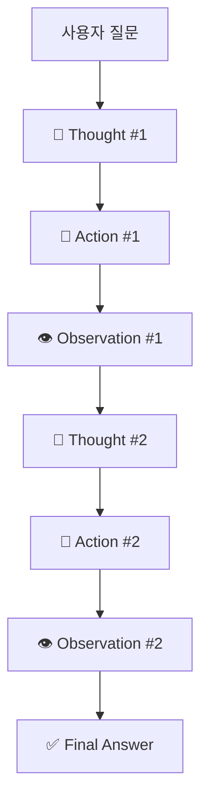

# 🤖 ReAct 에이전트 패턴 정리

ReAct는 "Reasoning + Acting"의 약자로, LLM 기반 에이전트가 **추론(Thought)**과 **행동(Action)**을 번갈아 수행하면서 문제를 해결하는 프레임워크입니다. LangChain에서도 대표적인 에이전트 실행 방식으로 사용됩니다.

---

## 📌 핵심 개념 (Core Concepts)

| 구성 요소 | 설명 |
|------------|------|
| **Thought** | 에이전트가 현재 상황을 기반으로 어떤 생각을 하고 있는지 서술 (*"I need to search this term..."*) |
| **Action** | 외부 도구(tool)를 호출하거나 특정 행동을 수행 (*"Search[\"LangGraph\"]"*) |
| **Observation** | Action 수행 결과를 받아들임 (*"LangGraph is a framework for..."*) |
| **Final Answer** | 충분한 정보가 모이면 최종 응답 도출 (*"LangGraph는 ...입니다."*) |

---

## 🔁 ReAct 루프 구조



- Thought → Action → Observation 과정을 여러 번 반복하면서 점차 정답에 다가감

---

## 💬 예시 (LangChain 기반)

**질문:** "서울의 오늘 날씨는 어때?"

```
Thought: 사용자가 현재 서울 날씨를 궁금해 한다. 날씨 API가 필요하다.
Action: CallWeatherAPI["Seoul"]
Observation: "Seoul weather is sunny, 23°C."
Thought: 정보를 얻었으므로 답변할 수 있다.
Final Answer: 오늘 서울은 맑고 기온은 약 23도입니다.
```

---

## ⚙️ LangChain에서의 ReAct

- LangChain에서는 `AgentExecutor`에 `ReActAgent` 설정으로 사용
- 각 Action은 등록된 Tool 중에서 선택되어 호출됨
- Observation은 Tool의 리턴값
- Final Answer가 나오기 전까지 루프 반복

---

## 🔍 기존 체인 방식과의 비교

| 항목 | 체인 기반 | ReAct 기반 Agent |
|------|-----------|------------------|
| 흐름 | 선형 | 비선형, 반복 가능 |
| 도구 사용 | 수동 지정 | Thought에 따라 자동 선택 |
| 자기 추론 | ❌ 없음 | ✅ Thought 단계에서 수행 |
| 오류 수정 | 어려움 | Observation 기반 재시도 가능 |

---

## 📝 요약 (Summary)

- ReAct는 LLM이 **스스로 추론하고**, **도구를 사용하고**, **결과를 반영**하는 루프 구조
- 보다 유연하고 반성적인 AI 에이전트를 구성할 수 있음
- LangChain에서도 ReAct 패턴은 핵심적인 실행 흐름으로 사용됨


