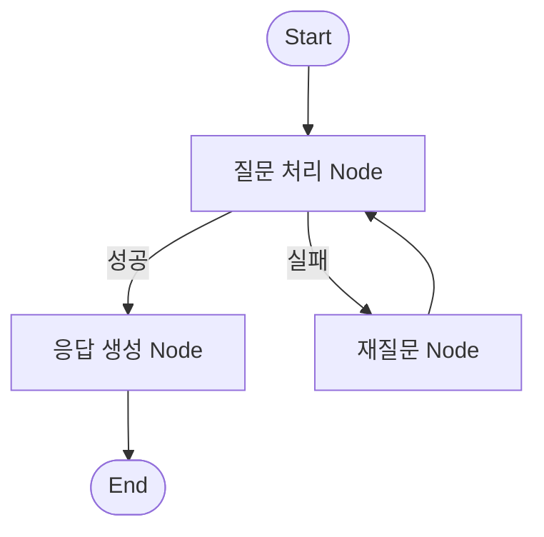

# 🧩 LangGraph 상태 모델 정리

LangGraph는 LLM 기반 에이전트 시스템에서 복잡한 흐름을 **노드(Node), 엣지(Edge), 상태(State)**로 선언적으로 구성할 수 있도록 돕는 프레임워크입니다.

---

## 📌 구성 요소

| 요소 | 설명 |
|------|------|
| **Start Node** | 그래프의 시작 지점. 일반적으로 사용자 입력이나 초기 액션 발생 |
| **End Node** | 처리 흐름의 종료 지점. 최종 응답 또는 결과 반환 |
| **Node** | 하나의 작업 단위. LLM 호출, 도구 사용, 판단 등 다양한 동작 포함 |
| **Edge** | 노드 간의 연결 흐름. 작업이 끝난 후 다음 노드로의 경로 |
| **Conditional Edge** | 조건에 따라 흐름을 분기시키는 엣지 (예: 오류 여부에 따른 처리 분기) |
| **State** | 전체 워크플로우에서 공유되는 데이터 컨텍스트 (입력, 결과, 메모리 등) |

---

## 📐 LangGraph 흐름 예시 (다이어그램)



---

## 🧪 코드 예제 (LangGraph 상태 기반 흐름)

```python
from langgraph.graph import StateGraph
from langgraph.graph.message import add_messages
from langchain_core.runnables import RunnableLambda

# 상태 구조 정의
def add_question(state):
    state["question"] = "서울 날씨는?"
    return state

def create_answer(state):
    state["answer"] = f"'{state['question']}'에 대한 응답입니다."
    return state

# 상태 그래프 구성
graph_builder = StateGraph(dict)
graph_builder.add_node("question_node", RunnableLambda(add_question))
graph_builder.add_node("answer_node", RunnableLambda(create_answer))

graph_builder.set_entry_point("question_node")
graph_builder.add_edge("question_node", "answer_node")
graph_builder.set_finish_point("answer_node")

app = graph_builder.compile()

# 실행 예시
output = app.invoke({})
print(output["answer"])
```

---

## ✅ 활용 포인트
- LangGraph는 **조건 분기 + 반복 + 상태 기반 판단**이 중요한 복잡한 Agentic AI 흐름에서 매우 효과적입니다.
- 위 예제는 단순한 흐름이지만, 멀티에이전트 협업, Reflection, RAG 통합도 가능합니다.

---

추가로 다이어그램이나 노드별 로직 설명을 시각화하거나, LangGraph + LangChain의 통합 사례도 구성 가능합니다.

