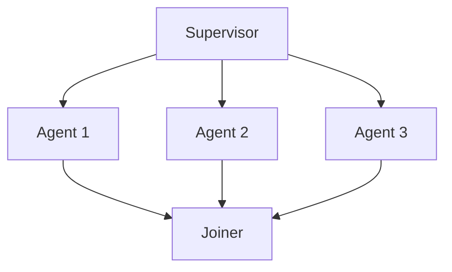

# 🧠 Multi-Agent Supervisor vs LangGraph Supervisor vs LangGraph Swarm

---

## 📈 요약 비교

| 가능 | 정의 | 주요 역할 | 특징 |
|------|------|-----------|------|
| **Multi-Agent Supervisor** | 멀티 에이전트 시스템에서 각 에이전트를 관리하고 작업을 분합하는 중압 컨트롤러 | 라우팅, 작업 분합, 결과 통합 | LangChain, LangGraph, 도구없는 구조에서도 활용 가능 |
| **LangGraph Supervisor** | LangGraph 내에서 상태과 화력을 제어하는 노드로, 다음 건을 결정 | 조건 분기, 에이전트 호출, 루프 제어 | 게시판구의 구조에서 동작 (개발자 정의) |
| **LangGraph Swarm** | LangGraph에서 복수의 에이전트들이 병력로 작업을 수행하고 결과를 채택\uud558는 패턴 | 동시 실행, 결과 합치 | 다수 에이전트를 동시에 실행, Fan-out/Gather 구조

---

## 탐색 형 역할 설명

### 1. 🤖 Multi-Agent Supervisor

- 일반적인 가능 (LangChain, LangGraph 외에서도 사용)
- 여러 에이전트에게 **서비스 턴두** 분합 → 다시 통합 및 총체 판단

형 구조:
```
사용자 질문 → Supervisor → Search Agent + Code Agent
                              → Supervisor → 응답 통합 → 사용자
```

### 2. 🗌 LangGraph Supervisor

- LangGraph 내 **Node** 또는 구조 전체의 가지고 개정 되는 컨트롤 요소
- “그룹 아규정”이나 “그룹 조건분기”을 시그링 할 수 있고,
- 상태 (state)를 가까워 동작

모양:
```python
def router_node(state):
    if "weather" in state["input"]:
        return "weather_agent"
    elif "code" in state["input"]:
        return "code_agent"
```

### 3. 🐝 LangGraph Swarm

- 다수의 agent에게 **같은 입력**을 보내고 결과를 합치\uud558는 것이 확실
- `Fan-out → Gather` 구조 개발 가능



---

## ✅ 어느 것을 어느 상황에?

- ❌ 간단한 라우팅 구조 및 멀티 에이전트 협조: **LangGraph Supervisor**
- ✅ 병력 행사 결과 판결/통합 필요: **LangGraph Swarm**
- 📅 LangGraph 외의 역할 또는 모든 구조에 최적 자원: **Multi-Agent Supervisor**

---
Multi-Agent Supervisor

User sends a query.

Supervisor/Router analyzes the intent or decomposes the task.

It routes subtasks to different collaborator agents.

Each collaborator processes its part and returns a result.

Supervisor receives all results, possibly merges or evaluates them.

Supervisor returns final answer to the user.

LangGraph Supervisor

User sends a query.

사용자가 LangGraph를 통해 질문 또는 명령을 전달합니다.

Graph engine initiates execution via the supervisor node.

그래프의 Supervisor 노드에서 실행이 시작되며, 전체 워크플로우의 흐름을 제어합니다.

Supervisor (as a control node) checks current state and determines path.

Supervisor는 공유된 상태(State)를 기반으로 다음에 어떤 노드를 호출할지 조건적으로 결정합니다. (예: "검색 먼저 할지, 바로 응답 생성할지")

It routes the flow to functional nodes (e.g., tool use, LLM call, collaborator agents).

각 노드 (검색 에이전트, 계산기, 응답 생성기 등)로 제어를 분기시킵니다.

Each node returns its output and updates the shared state.

호출된 노드는 결과를 반환하고 상태를 업데이트합니다.

Supervisor uses updated state to decide next steps.

Supervisor는 갱신된 상태 정보를 바탕으로 다음 엣지/노드 경로를 조건적으로 다시 선택합니다.

Process continues until a terminal node (e.g., response) is reached.

그래프의 종료 노드에 도달할 때까지 반복하며, 최종적으로 사용자에게 응답이 반환됩니다.

LangGraph에서는 Supervisor가 단순히 "분기자(router)" 역할뿐 아니라 상태 기반 흐름 제어자로 작동한다는 점이 핵심입니다.

그래서 Multi-Agent Supervisor보다 더 동적이고 조건 중심의 흐름 제어가 가능합니다.

LangGraph Swarm

User sends a query.

Swarm supervisor broadcasts the task to multiple agents (collaborators) simultaneously.

Each collaborator receives the shared state or problem statement.

Collaborators reason independently and return partial answers, hypotheses, or ideas.

The Swarm supervisor collects all feedback.

Supervisor may use voting, ranking, or synthesis to merge answers.

A final answer is composed and returned to the user.

LangGraph Swarm은 "하나의 경로를 따라가는" 방식이 아니라, 여러 에이전트가 병렬로 참여해 협력적 사고(collaborative reasoning)를 통해 문제를 해결하는 구조입니다.


----
여러 패턴에 따라 더 그림적인 예제가 필요하시면 자세한 영역 또는 코드도 드립니다!


---

graph TD

%% Multi-Agent Supervisor 구조
    U1[User Query] --> S1[🔁 Multi-Agent Supervisor]
    S1 -->|Decompose Task| MA1[🔍 Search Agent]
    S1 --> MA2[🧑‍💻 Code Agent]
    S1 --> MA3[☁️ Weather Agent]
    MA1 --> S1
    MA2 --> S1
    MA3 --> S1
    S1 --> R1[✅ Final Response]

    subgraph "🌐 Multi-Agent Supervisor"
        S1
        MA1
        MA2
        MA3
    end

%% LangGraph Supervisor 구조
    U2[User Query] --> S2[🔁 LangGraph Supervisor]
    S2 -->|Step 1| L1[🔍 Search Node]
    L1 -->|Step 2| L2[🔄 Reflection Node]
    L2 -->|Step 3| L3[📝 Answer Generator]
    L3 --> R2[✅ Final Answer]

    subgraph "📊 LangGraph Supervisor (Graph Flow)"
        S2
        L1
        L2
        L3
    end

%% LangGraph Swarm 구조
    U3[User Query] --> SW[🧠 LangGraph Swarm]
    SW -->|Broadcast Task| C1[🤝 Collaborator 1]
    SW --> C2[🤝 Collaborator 2]
    SW --> C3[🤝 Collaborator 3]
    C1 --> SW
    C2 --> SW
    C3 --> SW
    SW --> R3[✅ Synthesized Final Answer]

    subgraph "🕸️ LangGraph Swarm (Collaborative Agents)"
        SW
        C1
        C2
        C3
    end
