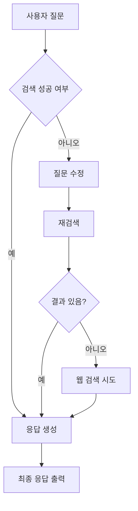

# 🔄 LangGraph란?

LangGraph는 **LLM 기반 애플리케이션의 흐름을 그래프 구조로 표현**할 수 있게 해주는 오픈소스 프레임워크입니다. 복잡한 상태 기반 로직, 멀티 에이전트 협업, 조건 분기 등을 **시각적이고 선언적으로 구성**할 수 있도록 돕습니다.

---

## 🧠 핵심 개념

| 요소 | 설명 |
|------|------|
| **Node (노드)** | LLM 호출, 함수 실행 등 개별 작업 단위 |
| **Edge (엣지)** | 한 노드에서 다음 노드로의 흐름 경로 |
| **State (상태)** | 전체 워크플로우가 공유하는 데이터 컨텍스트 |
| **Graph (그래프)** | 노드 + 엣지 + 상태로 구성된 전체 작업 흐름 |

---

## ✨ 왜 필요한가?

기존 LangChain의 체인은 선형 흐름 중심이지만, 실제 애플리케이션은 다음과 같은 요구가 있습니다:

- ✅ 조건 분기 (예: "실패 시 재시도", "오류 시 다른 경로로")
- 🔁 반복 루프 (예: 재질문 → 재검색 → 다시 응답)
- 🧑‍🤝‍🧑 멀티 에이전트 시스템 (역할 분담 & 협업)
- 🧭 상태 기반 판단 (예: 이전 결과에 따라 다음 단계 결정)

LangGraph는 이런 **복잡한 흐름을 명확하게 시각화하고 유지 관리**할 수 있도록 지원합니다.

---
# ⚙️ LangChain부터 Agentic AI까지: 한계와 확장 전략

LLM 기반 응용 시스템을 구성할 때, 많은 개발자들이 LangChain을 시작점으로 선택합니다. 하지만 실제 서비스 수준의 AI를 구현하기 위해서는 **LangChain 단독으로 해결할 수 없는 한계**를 인식하고, **에이전트 구조, 툴 연동, RAG 등의 전략적 확장**이 필요합니다.

---

## 🧩 LangChain의 역할
LangChain은 LLM을 활용한 애플리케이션을 **체인 방식**으로 구성할 수 있는 프레임워크로,
- 프롬프트 체인 구성
- 메모리 관리
- 템플릿 활용
- 간단한 툴 연동
등에 강점을 가집니다.

하지만...

---

## ❗ LangChain 단독 사용의 한계

| 유형 | 한계 설명 |
|------|-----------|
| **실시간 정보** | LLM은 훈련된 데이터 외에 외부 세계에 대한 정보가 없음 → 현재 시간, 날씨, 뉴스 등 제공 불가 |
| **복잡한 분기 로직** | 체인은 선형 흐름에 최적화되어 있어 조건 분기, 반복, 에이전트 협업 등 구현이 어려움 |
| **반성적 추론 (Reflection)** | 생성된 결과에 대한 검증/수정 반복 과정이 자동화되어 있지 않음 |
| **장기 컨텍스트 유지** | 메모리/컨텍스트 전략이 부족하여 다단계 대화나 복잡한 문맥 유지가 어려움 |
| **검색 기반 보완 한계 (RAG)** | 검색 결과가 없거나 적절하지 않을 경우 fallback이 없음 → '재질문', '웹검색' 등 전략적 루프 미지원 |

---

## 🧠 Agent + Tool + RAG로 확장하기

LangChain의 한계를 극복하기 위한 대표 전략은 다음과 같습니다:

### 1. 🔧 Tool Use
LLM이 직접 할 수 없는 연산/정보 탐색/API 호출을 **외부 도구로 분리**하고 Agent가 선택해 사용

- 📦 예: 날씨 API, 계산기, 웹 브라우저, DB 조회 등
- 📘 LangChain → `Tool` 등록 후 Agent가 호출

### 2. 🤖 Agentic 구조
다양한 역할의 에이전트를 생성하여 협력/분업 기반 문제 해결

- 질문 분석, 정보 검색, 응답 생성, 평가 에이전트를 각각 설계
- 조건 분기, 반복 수행 등 유연한 흐름 구현 가능

### 3. 📚 Retrieval-Augmented Generation (RAG)
LLM이 모르는 질문에 대해 외부 벡터 DB 또는 문서 검색 시스템과 연계

- 사용자 질문 → 검색 → 관련 문서 → LLM 입력 → 응답 생성
- 최신 정보, 사내 문서 기반 지식 접근 가능

→ ✅ 단점: 검색 문서에 정답이 없을 경우 fallback 없음
→ 🔁 개선: 재질문 + 재검색 루프 필요 → LangGraph로 해결 가능

### 4. 🔄 Reflection
LLM이 스스로 자신의 결과를 검토하고 오류를 수정할 수 있는 메타인지 구조

- "이 답이 맞는가?", "테이블 이름 틀렸는데?" 등의 자기 평가
- 잘못된 응답에 대한 재시도 루프 가능

---

## 💡 LangGraph와 함께 확장하는 예시
LangGraph는 복잡한 흐름을 그래프 기반으로 시각화하고 제어할 수 있도록 돕습니다.

### 예시 다이어그램: Adaptive RAG

---

## 📌 요약 비교

| 항목 | LangChain 단독 | Agent + Tool + RAG + LangGraph 확장 |
|------|------------------|-------------------------------------|
| 실시간 응답 | ❌ 불가 | ✅ Tool/검색 사용으로 해결 |
| 복잡한 흐름 | ❌ 제약 있음 | ✅ LangGraph, Agent로 해결 |
| 검색 실패 대응 | ⚠️ 없음 | ✅ 질문 재작성, 재검색 루프 가능 |
| 정확성 | ⚠️ 한계 존재 | ✅ Reflection으로 개선 |
| 사용자 정의 처리 | ⚠️ 한정적 | ✅ 다양한 도구 조합 가능 |

---

## 🚀 결론
LangChain은 **LLM 응용의 기초 체계**를 제공하지만, 실제 서비스 수준의 에이전트를 구축하기 위해서는 **멀티에이전트, 도구 연동, 검색 확장, 반성적 루프** 등이 필요합니다.

LangGraph, RAG 시스템, Tool 호출 등을 적절히 조합함으로써 더욱 강력하고 실용적인 AI 시스템을 구성할 수 있습니다.

