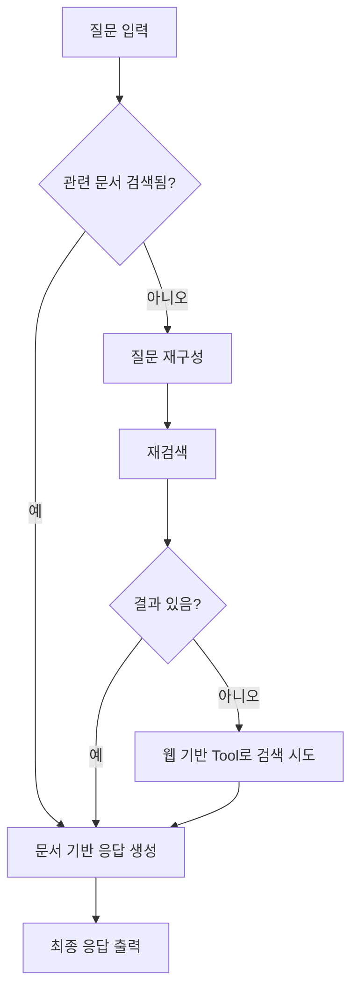

# 🔗 LangChain vs LangGraph 비교 정리

LangChain과 LangGraph는 모두 LLM(대형 언어 모델)을 활용한 애플리케이션 구축을 돕는 프레임워크지만, 목적과 구조에서 중요한 차이점이 있습니다. 이 문서는 두 기술의 **비교와 쓰임새 차이**를 명확히 정리한 것입니다.

---

## 🧩 핵심 비교

| 항목 | LangChain | LangGraph |
|------|-----------|-----------|
| 구조 | 선형(Chain 구조) | 상태 기반 비선형(그래프 구조) |
| 흐름 | 순차적 | 조건 분기, 반복, 병렬 처리 가능 |
| 목적 | 간단한 LLM 체인 구성 | 복잡한 LLM 워크플로우 구성 |
| 상태 관리 | 기본 메모리 | 명시적 상태 객체(State) 공유 |
| 적합한 예 | 단일 LLM 응답, Tool 연동 | 멀티에이전트 협업, Adaptive RAG, 반복 추론 등 |
| 시각화 | 제한적 | 그래프 시각화 가능 (Mermaid 등) |
| 주요 활용 | 프롬프트 템플릿, Tool 호출, 메모리 관리 | 분기 처리, 에이전트 협업, Reflection Loop 설계 |

---

## 🧠 각각의 특징 요약

### LangChain이란?
- LLM 체인을 쉽게 구성할 수 있는 도구
- 프롬프트 템플릿, 툴 연동, 메모리 관리 등 기본 기능 제공
- 간단한 응답 생성 파이프라인에 적합

**예시**: 사용자 질문 → 툴 검색 → 응답

### LangGraph란?
- LangChain 위에서 동작하는 확장 프레임워크
- 노드(Node), 엣지(Edge), 상태(State)를 조합하여 **복잡한 흐름을 그래프 구조로 설계**
- 조건 분기, 루프, 멀티에이전트 등 복잡한 로직 구현 가능

**예시**: Adaptive RAG, Reflection 기반 질의 반복, 문제 해결 루프 등

---

## 🧪 대표 흐름 예시 (Adaptive RAG)

---

## ✅ 정리

- LangChain은 LLM 사용을 쉽게 하기 위한 **입문 도구**이자 **기본 체계**
- LangGraph는 **복잡한 흐름과 협업을 시각적으로 제어**하기 위한 **고급 확장 도구**

둘은 **상호보완적**이며, LangGraph는 LangChain의 위에서 동작하여 복잡한 시스템 구성을 가능하게 만듭니다.

